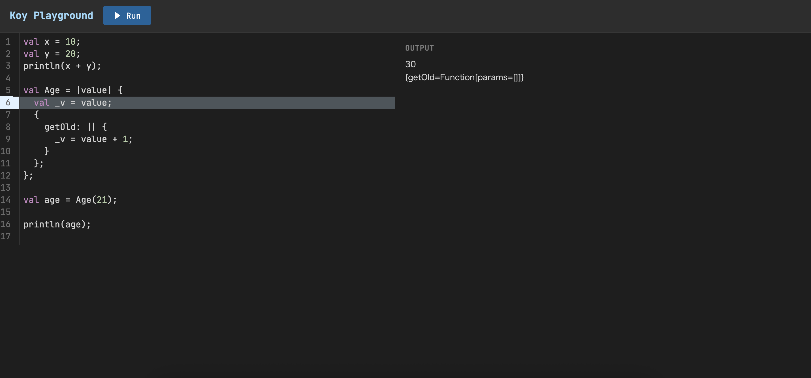

# Koy Playground

A web-based execution environment for the Koy programming language.
Write and run Koy code directly in your browser.

## Prerequisites

| Tool | Version |
|---|---|
| JDK | 21 or later |
| Node.js | LTS (managed via mise) |
| pnpm | 10.33.0 (managed via mise) |

Install [mise](https://github.com/jdx/mise):

```bash
curl https://mise.run | sh
```

Then set up Node.js and pnpm:

```bash
mise install
```

## Build

From the repository root, build the frontend and bundle it into backend static resources:

```bash
cd koy-playground/frontend
pnpm install
pnpm build
cd ../..
./gradlew :koy-playground:build
```

## Run dev server(frontend only)

Keeping backend on running, can start frontend dev server. 

Frontend dev server only watch frontend changes. To rebuild backend, restart backend server.

```bash
mise exec -- pnpm dev
```

## Run

Start the server from the repository root:

```bash
./gradlew :koy-playground:run
```

The server starts on `http://localhost:8080`.

## Usage


